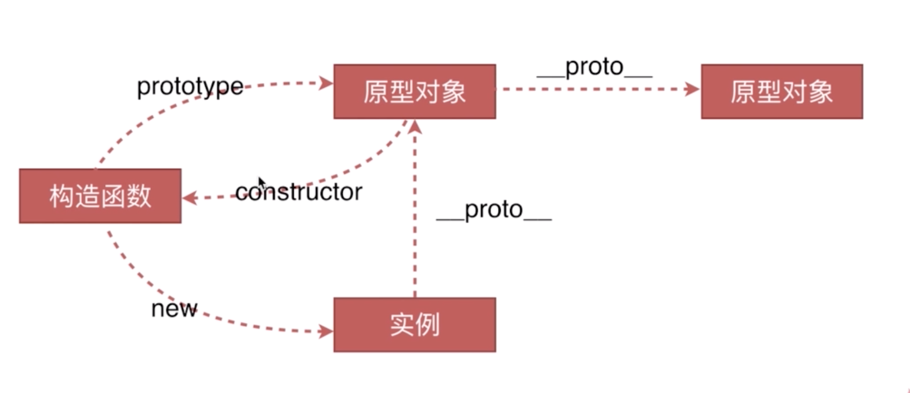
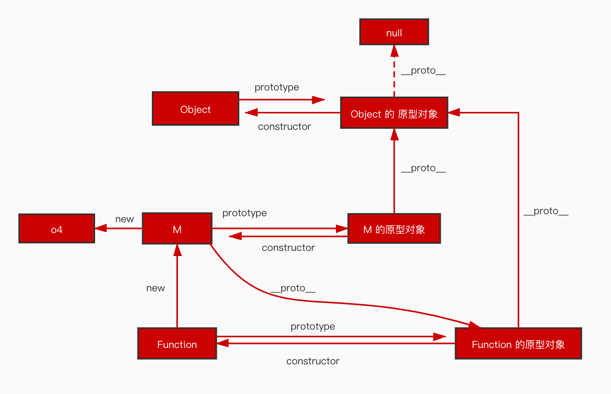

# 原型链

## 创建对象的方式

有三种创建对象的方式，分别如下：

对象字面量

```js
var o1 = {name:'o1'}
```

构造函数

```js
var o2 = new Object({name:'02'})

function M(name) {
  this.name = name
}
var o3 = new M('o3')
```

通过 Object.create 方法创建对象

```js
var p = {name:'p'}
var o4 = Object.create(p)
```

## 实例、构造函数、原型对象的关系

通过`new`关键字调用一个函数，这个函数被称为构造函数。实例是被构造函数创建的，每一个函数都有一个`prototype`属性(注意：不是构造函数才有`prototype`属性)指向它的原型对象，这个原型对象有一个`constructor`属性又指回函数。构造函数实例化出的实例有一个`__proto__`属性指向构造函数的实例对象。



## 原型链

从实例往上找构造这个实例的相关联的对象，然后这个关联的对象再往上找构造它的相关联的对象，以此类推，一直到 Object.prototype

## instanceof 的原理

instanceof 是比较左侧实例的`__proto__`是否与右侧构造函数的`prototype`相等，如果相等就返回 true，否则返回 false。由于原型链的关系，只要右侧构造函数的`prototype`出现在左侧实例的原型链上都会返回 true

```js
function M(name) {
  this.name = name
}
var o4 = new M('o4')

// 因为 o4.__proto__ === M.prototype, 所以 o4 instanceof M 为 true
o4 instanceof M // true

// o4.__proto__.__proto__ === Object.prototype, 所以 o4 instanceof Object 为 true
o4 instanceof Object // true
```



## new 运算符

第一步：创建一个新的对象，将新对象的 `__proto__` 指向构造函数的 `prototype`

第二步：执行构造函数，将上下文（this）执行第一步中创建的新对象

第三步：如果构造函数返回了一个对象，那么返回的对象会取代 new 出来的对象，否则使用 new 出来的对象
